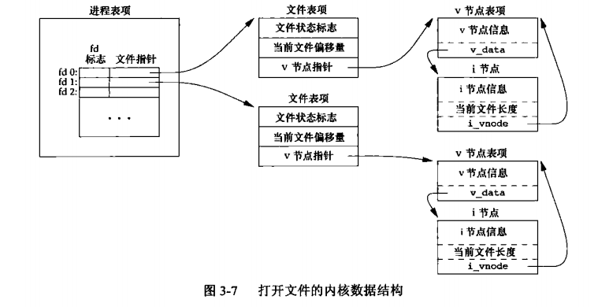

# 总结部分 文件和I/O

不带缓冲的底层IO
```
#include <fcntl.h>
int open(const char *pathname,int flag,...);
int openat(int fd,const char* pathname,int flag,...);
```
flag包括以下宏定义
必选不兼容宏: O_RDONLY、O_WRONLY、O_RDWR、O_SEARCH、O_EXEC(前三个必有实现，后两个不一定)
可以通过switch(flag & O_ACCMODE)的方式查看
可选兼容:O_CREAT、O_TRUNC、O_APPEND、O_DIRECTORY、O_CLOEXEC、O_SYNC、O_DSYNC、O_EXCL、O_NOCTTY、O_NOFOLLOW、O_NONBLOCK

当pathname为绝对路径时，openat指定的fd无效

```
#include <fcntl.h>
int creat(const char *path,mode_t mode)
```
mode_t为int类型，可以指定为比如0666，creat函数等同于open(path,O_CREAT | O_TRUNC | O_WRONLY,mode);

```
#include <unistd.h>
int close(int fd)
```
注意及时你不关闭fd,系统也会默认关闭fd

```
#include <unistd.h>
int lseek(int fd,off_t offset,int whence)
```
whence可以是SEEK_SET(0)\SEEK_CUR(1)\SEEK_END(2)
如果fd指向管道、FIFO、网络套接字会返回-1

```
#include <unistd.h>
ssize_t read(int fd,void *buf,size_t nbytes)
ssize_t write(int fd,void *buf,size_t nbytes)
```
返回读取/写入成功的字节数，读到末尾返回0
终端设备最多每次读一行

文件共享:文件的管理


```
#include <unistd.h>
ssize_t pread(int fd,void *buf,size_t nbytes,off_t offset)
ssize_t pwrite(int fd,void *buff,size_t nbytes,off_t offset)
```
该函数相当于lseek和write的原子操作，不改变当前文件的偏移量，从开始处的offset位置开始读写

```
#include <unistd.h>
int dup(int fd)
int dup2(int fd,int fd2)
```
```
#include <unistd.h>
void * sync(void *)
int fsync(int fd)
int fdatasync(int fd)
```
内核和磁盘文件之间存在缓冲，sync通常每个一段时间(比如30s)就会调用，调用后直接返回，不等待读写完成
fsync和fdatasync都会等待缓存结束，但是前者包括数据和文件属性，后者只包括数据

```
#include <fcntl.h>
int fcntl(int fd,int cmd,...)
```
fcntl包含下面的功能:
(1)复制文件描述符:F_DUPFD\F_DUPFD_CLOEXEC
(2)获取/设置文件描述符标志:F_GETFD\F_SETFD
(3)获取/设置文件状态标志:F_GETFL\F_SETFL
(4)获取/设置异步IO所有全:F_GETOWN\F_SETOWN
(5)获取/设置文件记录锁:F_GETTLK\F_SETLK\F_SETLKW


```
#include "apue.h"
#include <fcntl.h>

int main(int argc, char *argv[]) {
    int val;

    if (argc != 2) {
        err_quit("usage: a.out <descriptor#>");
    }

    if ((val = fcntl(atoi(argv[1]), F_GETFL, 0)) < 0) {
        err_sys("fcntl error for fd %d", atoi(argv[1]));
    }

    switch (val & O_ACCMODE) {
        case O_RDONLY:
            printf("read only");
            break;
        case O_WRONLY:
            printf("write only");
            break;
        case O_RDWR:
            printf("read write");
            break;
        default:
            err_dump("unknown access mode");
    }

    if (val & O_APPEND) {
        printf(", append");
    }

    if (val & O_NONBLOCK) {
        printf(", nonblocking");
    }

    if (val & O_SYNC) {
        printf(", synchronous writes");
    }

#if !defined(_POSIX_C_SOURCE) && defined(O_FSYNC) && (O_FSYNC != O_SYNC)
    if (val & O_FSYNC)
        printf(", synchronous writes");
#endif

    putchar('\n');

    return 0;
}
```
# 问题

## 3.1
读/写磁盘文件时，本章中描述的函教确实是不带缓冲机制的吗?请说明原因

在内存当中无缓冲，但是内核和磁盘之间存在缓冲

## 3.2
编写一个与3.12节中 dup2功能相同的函数，要求不调用fcntl函数，并且要有正确的出错处理。

见[3_2.c](./3_2.C)

## 3.3
假设一个进程执行下面3个函数调用：
fdl = open(path,oflags);
fd2 = dup(fd1):
fd3 = open(path,oflags):
面出类似于图3-9的结果图，对 fcntl作用于 fd1来说，F_SETFD命令会影响哪一个文件描述符?F_SETFL呢?

fd1，fd2指向同一个文件描述符表项1，fd3指向文件描述符表项2，两个表项指向同一个v节点，F_SETFD影响fd1，FSETFL影响fd2;
## 3.4
略
## 3.5
说明下面两个命令的区别
./a.out > outfile 2>&1
./a.out 2>&1 > out file

shell命令行是自左向右读取，2>&1的命令可以理解为dup2(1,2)
一:dup2(outfile,1)，dup2(1,2）最后1，2均指向outfile
二:dup2(2,1),dup(outfile,1) 最后2指向标准输出，1指向outfile

## 3.6
如果以追加的方式打开一个文件以便读写，能否用lseek在任意位置读/写？

见[3_6.c](./3_6.c),读没问题，但是写似乎不接受lseek函数的影响
